# 실제 런칭 데이터 기반 성능 개선 경험기

# 🤔 학습 계기

이번 5차 요구사항에는 DB 쿼리 개선 과정이 포함되어 있었다. 하지만, 진행한 프로젝트는 개발자에 비해 추적할 테이블의 개수가 많아, 4명이 페어로 개선하기는 어려운 상황이었다. 그래서 각자 담당 테이블의 모든 조회 쿼리를 분석해 위험도를 평가한 뒤 개선할 후보를 선정했다.

이후에는 각자 Service 단위로 개선 작업을 나누어 진행하고, 서로의 접근 방식과 개선 방향을 공유하며 부족한 부분을 채워나가기로 했다. 그중에서 `FestivalNotificationService` 부분을 맡아 개선해보기로 했다. 이전 프로젝트에서도 쿼리 개선을 시도해본 경험은 있었지만, 당시에는 다소 감에 의존하거나 과정에 대한 이해가 충분하지 않은채 주먹구구 형태로 수행해 아쉬웠다.

마침 이번 프로젝트는 실제 서비스 런칭으로 유의미한 데이터가 쌓인 시점이었기에, 이를 바탕으로 보다 체계적인 분석과 실험을 통해 의미 있는 개선을 이루고자 했다. ☺️

# 📚학습 내용 정리

DB 쿼리 개선을 위해서는 `Festival`, `Device`, `FestivalNotification` 세 개의 테이블 데이터가 필요했다. 이 중 `Festival` 테이블은 프로젝트 전반에서 공통으로 사용되고 있었기 때문에, 약 5,400개의 데이터(= 600개 대학 × 연 3회 × 3년치)가 테스트 서버에 삽입되어 있었다.

따라서 이번 개선에서는 `Device`, `FestivalNotification` 테이블의 데이터를 추가로 준비해야 했다. 문제는 얼마나 현실적인 데이터 양을 설정할 것인가였다. 이 기준을 잡기 위해 실제 런칭 시점의 통계를 참고했다.

런칭 당시에는 아직 부족한 부분과 활용 용도를 정확하게 파악하지 못해 적극적으로 서비스를 활용하지 못했다. 그럼에도 불구하고 2개 대학은 축제 운영에 서비스를 활발히 도입해 홍보했고, 이들의 데이터를 분석해 테스트 데이터의 규모를 추정했다. 즉, 실제 사용 패턴을 반영해 테스트 환경에서도 현실적인 부하를 재현할 수 있도록 구성한 것이다.

## 📊 실제 런칭 기반 테스트 데이터 측정

국내 대학(캠퍼스 포함)은 약 500 ~ 600개교이며, 각 대학의 평균 재학생 수는 약 5,000 ~ 6,000명 수준이다. 실제 런칭 데이터를 바탕으로, 전체 재학생 중 약 15% 정도의 서비스 이용률을 기대할 수 있었다. 이를 기준으로 연 3회 개최되는 축제 데이터를 3년간 축적했을 때의 규모를 다음과 같이 추정했다.

이중에서 실측 데이터 기반으로 약 15%의 사용률을 기대할 경우, 연간 3회의 축제 데이터를 3년간 축적했을 때의 규모를 다음과 같이 추정했다.

또한, 하나의 축제에서 동일한 DeviceId가 누적될 수 있지만, 실제 사용자들은 축제가 끝난 후 앱을 삭제하고 다음 축제 시점에 다시 설치하는 경향이 많았다. 따라서 매 축제마다 새로운 유입이 발생한다는 가정 하에 데이터를 산출했다.

### 실제 서비스 이용 데이터

| 대학       | 재학생 수  | 실제 사용자 수 | 사용률    |
|----------|--------|----------|--------|
| 한O대학교    | 6,117명 | 약 1,000명 | 16.35% |
| 차 OOO대학교 | 2,228명 | 약 300명   | 13.46% |

- 현실적인 데이터 범위 12% ~ 18% 범위

### 테스트용 데이터 규모 추정

| 항목              | 값                  |
|-----------------|--------------------|
| 평균 재학생 수        | **6,000명**         |
| 접속 비율           | **15%**            |
| 1회 축제당 평균 사용자 수 | **900명**           |
| 1년당 축제 횟수       | **3회**             |
| 데이터 기간          | **3년 (2026~2028)** |
| 대학 수            | **600개 가정**        |
| 데이터 수           | 4,860,000          |

### FestivalNotification 테이블 실제 계산 예시

대학교별 접속자 대비 알림 허용 비율은 실제 데이터를 분석한 결과, 평균적으로 약 35% 수준으로 확인되었다. 따라서 전체 Device 데이터의 약 35%를 알림 등록 대상으로 가정하여 아래와 같이 계산했다.

또한 실제 데이터에서는 일부 사용자는 중간에 알림을 취소하는 사례도 존재했다. 대학교별로 편차는 크지 않았으며, 한 대학의 데이터를 기준으로 보면 전체 366명 중 45명이 알림을 해제해 약 12.3%의 구독 취소율을 보였다.

이를 반영해 최종 유지 구독자 수를 계산한 결과는 아래표와 같았다.

| 구분          | 계산식                 | 결과 (개수)       | 비율        |
|-------------|---------------------|---------------|-----------|
| 전체 Device 수 | -                   | **4,860,000** | 100%      |
| 알림 허용 수     | 4,860,000 × 0.35    | **1,701,000** | 35.0%     |
| 구독 취소 수     | 1,701,000 × 0.12295 | **209,226**   | 12.3%     |
| 최종 유지 구독자 수 | 1,701,000 − 209,226 | **1,491,774** | **30.7%** |

즉, 실제 런칭 데이터의 알림 허용률(35%)과 취소율(12.3%) 반영해 Device 및 FestivalNotification 두 테이블의 테스트 데이터를 현실적으로 구성했다.

---

## ⚒️쿼리 로그 & 성능 측정

해당 서비스는 알림 기능 중심의 서비스로 항상 외부 API 호출이 필수였다. 따라서 실험 과정에서는 가변적인 네트워크 지연 등 외부 요인을 배제하기 위해 테스트용 API와 서비스를 별도로 구축했다.

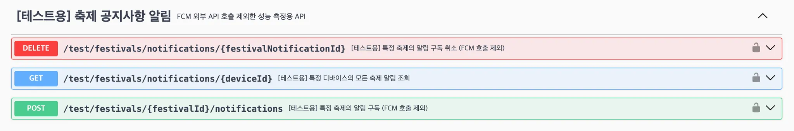
테스트용 API Swagger Docs

### 1. DELETE festivals/notifications//{festivalNotificationId}

- 축제에 알림을 OFF 기능 (SoftDelete)

첫 번째로 살펴본 API는 삭제 기능이었다. 개선 전 데이터를 삽입한 Dev 환경에서, K6를 활용해 부하테스트가 아니기에 직렬 요청으로 1,000회 수행한 평균 응답 시간을 측정했다.

|                 로컬 환경                 |              Dev 환경               |
|:-------------------------------------:|:---------------------------------:|
| 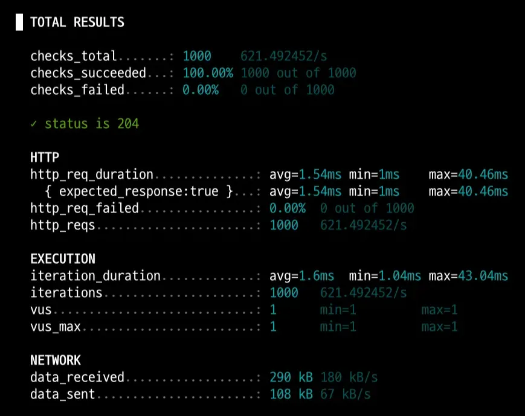 | 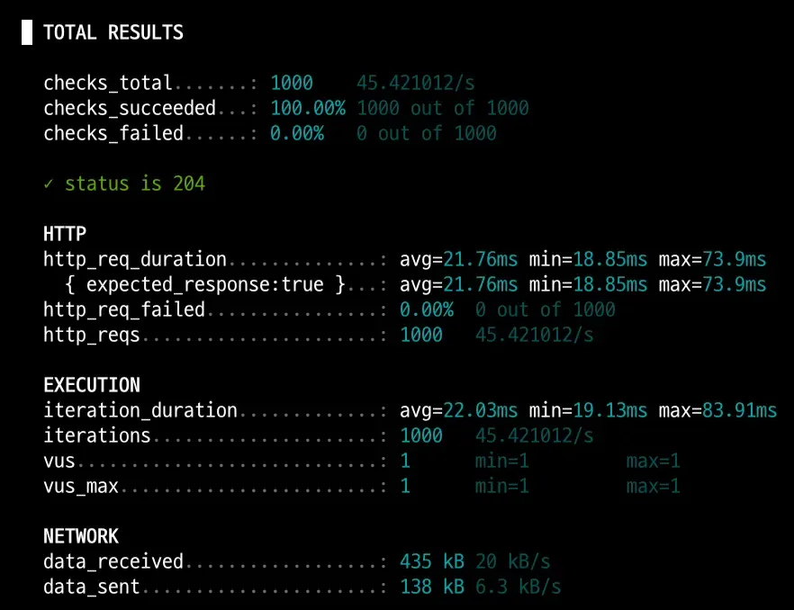 |

<details>
  <summary>쿼리 로그</summary>

``` SQL
Hibernate: 
    select
        fn1_0.id,
        fn1_0.created_at,
        fn1_0.deleted,
        fn1_0.deleted_at,
        fn1_0.device_id,
        fn1_0.festival_id,
        fn1_0.updated_at 
    from
        festival_notification fn1_0 
    where
        fn1_0.id=? 
        and (
            fn1_0.deleted = 0
        )
Hibernate: 
    select
        d1_0.id,
        d1_0.created_at,
        d1_0.deleted,
        d1_0.deleted_at,
        d1_0.device_identifier,
        d1_0.fcm_token,
        d1_0.updated_at 
    from
        device d1_0 
    where
        d1_0.id=? 
        and (
            d1_0.deleted = 0
        )
Hibernate: 
    UPDATE
        festival_notification 
    SET
        deleted = true,
        deleted_at = CURRENT_TIMESTAMP 
    WHERE
        id = ?

```

</details>

✅결론 : 쿼리 전반적으로 안정적이며, 이미 충분히 좋은 성능을 보였다. 추가 실험으로 복합 인덱스(deleted, id)를 적용해봤으나, deleted 값 변경 시 인덱스 갱신으로 인한 쓰기 비용 증가로 오히려 성능 저하가 발생했다.

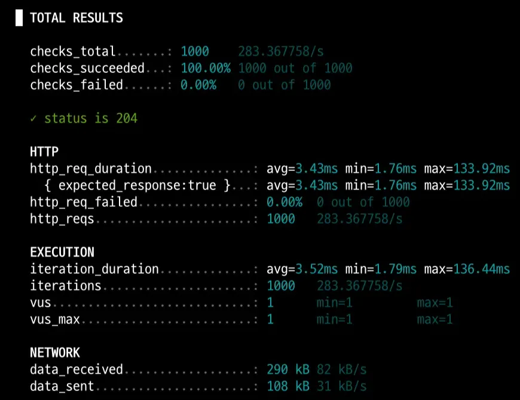
WAS(Local) DB(Local) - 복합 인덱스 실험


### GET festivals/notifications/{deviceId}

- 축제에 등록한 알림 조회 기능 (Device가 1개 **축제에만 알림 등록**된 경우)

두 번째로는 조회 API를 테스트했다. 동일하게 1,000회 직렬 요청을 기준으로 성능을 측정했으며, 두 가지 케이스로 나누어 실험을 진행했다. 하나는 Device에 단일 축제 알림만 등록된 경우, 다른 하나는 여러 축제 알림이 등록된 경우였다.

|              로컬 환경              |           Dev 환경            |
|:-------------------------------:|:---------------------------:|
| 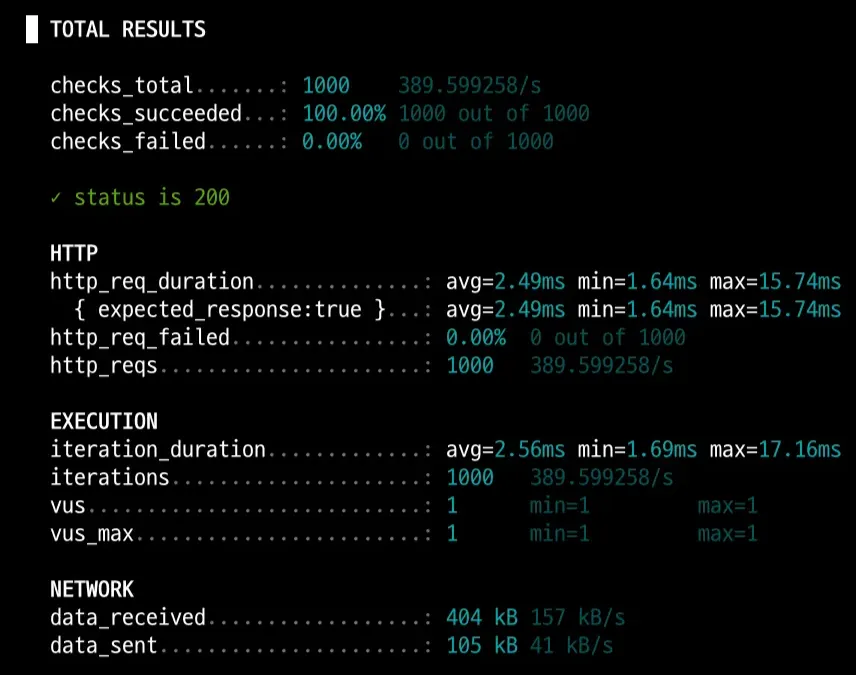 | 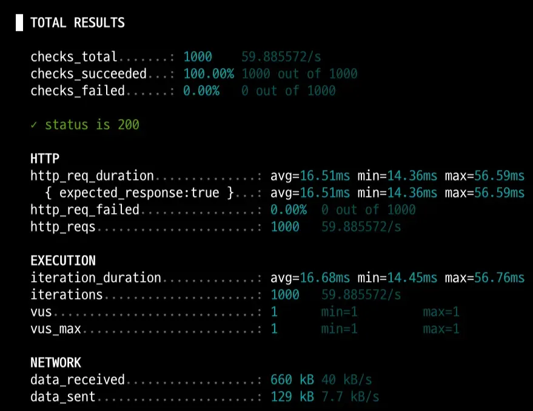 |

<details>
  <summary>쿼리 로그</summary>

``` SQL
Hibernate: 
    select
        d1_0.id,
        d1_0.created_at,
        d1_0.deleted,
        d1_0.deleted_at,
        d1_0.device_identifier,
        d1_0.fcm_token,
        d1_0.updated_at 
    from
        device d1_0
    where
        d1_0.id=?
        and (
            d1_0.deleted = 0
        )
Hibernate: 
    select
        fn1_0.id,
        fn1_0.created_at,
        fn1_0.deleted,
        fn1_0.deleted_at,
        fn1_0.device_id,
        fn1_0.festival_id,
        fn1_0.updated_at 
    from
        festival_notification fn1_0 
    left join
        device d1_0 
            on d1_0.id=fn1_0.device_id 
            and (d1_0.deleted = 0) 
    where
        (
            fn1_0.deleted = 0
        )
        and d1_0.id=?
Hibernate: 
    select
        f1_0.id,
        f1_0.latitude,
        f1_0.longitude,
        f1_0.created_at,
        f1_0.deleted,
        f1_0.deleted_at,
        f1_0.end_date,
        f1_0.festival_name,
        f1_0.lost_item_guide,
        f1_0.start_date,
        f1_0.university_name,
        f1_0.updated_at,
        f1_0.user_visible,
        f1_0.zoom,
        phb1_0.festival_id,
        phb1_0.latitude,
        phb1_0.longitude 
    from
        festival f1_0  
    where
        f1_0.id=? 
        and (
            f1_0.deleted = 0
        )
```
</details>

✅ 결론 : 불필요한 left join 제외하고는 쿼리와 속도는 안정적으로 수행하고 있었다.

- 축제에 등록한 알림 조회 기능 (Device가 10개 축제에 알림 등록된 경우)

|                     로컬 환경                     |                  Dev 환경                   |
|:---------------------------------------------:|:-----------------------------------------:|
| 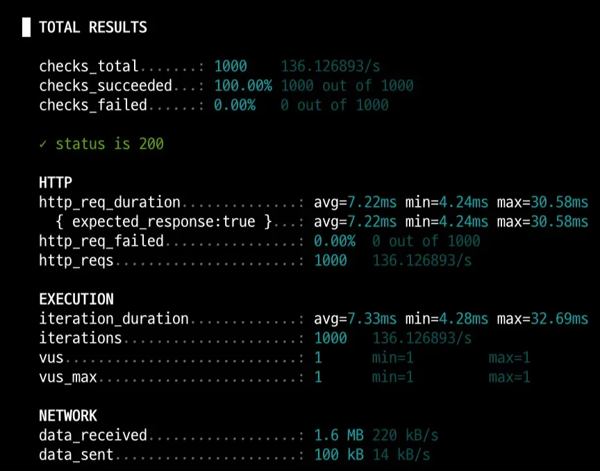 | 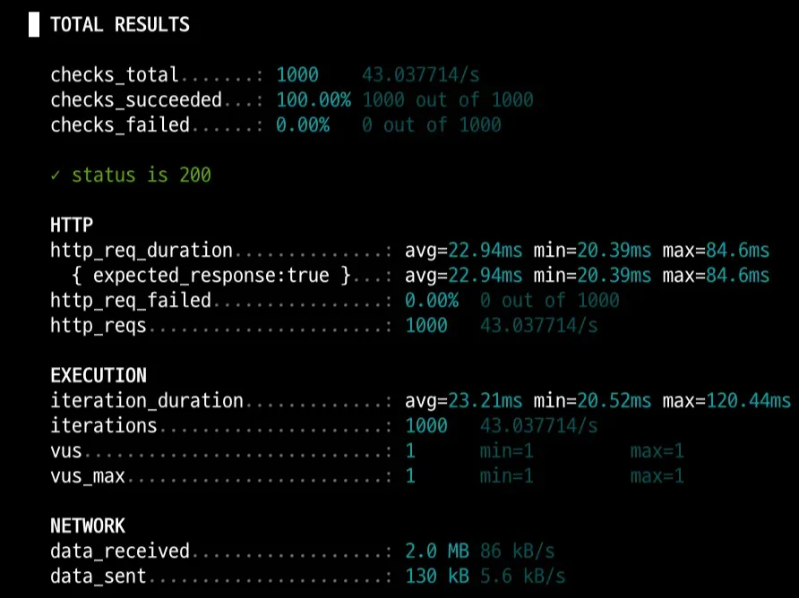 |

이 실험에서 확인한 핵심은 단일 구독(1개) 대비 다중 구독(10개)일 때 응답 시간이 크게 늘어난 점이다. 원인을 추적하기 위해 쿼리 로그를 분석했고, 아래와 같이 축제 10개를 조회하는 과정에서 N+1 문제가 발생하고 있음을 확인했다. 즉, 10개면 10번, 100개면 100번의 추가 쿼리가 발생하는 구조였다. 이는 JPA 사용상의 실수로 판단되어, 즉시 수정 대상으로 분류했다.

<details>
  <summary>쿼리 로그</summary>

``` SQL
Hibernate: 
    select
        d1_0.id,
        d1_0.created_at,
        d1_0.deleted,
        d1_0.deleted_at,
        d1_0.device_identifier,
        d1_0.fcm_token,
        d1_0.updated_at 
    from
        device d1_0 
    where
        d1_0.id=? 
        and (
            d1_0.deleted = 0
        )
Hibernate: 
    select
        fn1_0.id,
        fn1_0.created_at,
        fn1_0.deleted,
        fn1_0.deleted_at,
        fn1_0.device_id,
        fn1_0.festival_id,
        fn1_0.updated_at 
    from
        festival_notification fn1_0 
    left join
        device d1_0 
            on d1_0.id=fn1_0.device_id 
            and (d1_0.deleted = 0) 
    where
        (
            fn1_0.deleted = 0
        ) 
        and d1_0.id=?
Hibernate: 
    select
        f1_0.id,
        f1_0.latitude,
        f1_0.longitude,
        f1_0.created_at,
        f1_0.deleted,
        f1_0.deleted_at,
        f1_0.end_date,
        f1_0.festival_name,
        f1_0.lost_item_guide,
        f1_0.start_date,
        f1_0.university_name,
        f1_0.updated_at,
        f1_0.user_visible,
        f1_0.zoom 
    from
        festival f1_0 
    where
        f1_0.id=? 
        and (
            f1_0.deleted = 0
        )
Hibernate: 
    select
        f1_0.id,
        f1_0.latitude,
        f1_0.longitude,
        f1_0.created_at,
        f1_0.deleted,
        f1_0.deleted_at,
        f1_0.end_date,
        f1_0.festival_name,
        f1_0.lost_item_guide,
        f1_0.start_date,
        f1_0.university_name,
        f1_0.updated_at,
        f1_0.user_visible,
        f1_0.zoom 
    from
        festival f1_0 
    where
        f1_0.id=? 
        and (
            f1_0.deleted = 0
        )
Hibernate: 
    select
        f1_0.id,
        f1_0.latitude,
        f1_0.longitude,
        f1_0.created_at,
        f1_0.deleted,
        f1_0.deleted_at,
        f1_0.end_date,
        f1_0.festival_name,
        f1_0.lost_item_guide,
        f1_0.start_date,
        f1_0.university_name,
        f1_0.updated_at,
        f1_0.user_visible,
        f1_0.zoom 
    from
        festival f1_0 
    where
        f1_0.id=? 
        and (
            f1_0.deleted = 0
        )
Hibernate: 
    select
        f1_0.id,
        f1_0.latitude,
        f1_0.longitude,
        f1_0.created_at,
        f1_0.deleted,
        f1_0.deleted_at,
        f1_0.end_date,
        f1_0.festival_name,
        f1_0.lost_item_guide,
        f1_0.start_date,
        f1_0.university_name,
        f1_0.updated_at,
        f1_0.user_visible,
        f1_0.zoom 
    from
        festival f1_0 
    where
        f1_0.id=? 
        and (
            f1_0.deleted = 0
        )
Hibernate: 
    select
        f1_0.id,
        f1_0.latitude,
        f1_0.longitude,
        f1_0.created_at,
        f1_0.deleted,
        f1_0.deleted_at,
        f1_0.end_date,
        f1_0.festival_name,
        f1_0.lost_item_guide,
        f1_0.start_date,
        f1_0.university_name,
        f1_0.updated_at,
        f1_0.user_visible,
        f1_0.zoom 
    from
        festival f1_0 
    where
        f1_0.id=? 
        and (
            f1_0.deleted = 0
        )
Hibernate: 
    select
        f1_0.id,
        f1_0.latitude,
        f1_0.longitude,
        f1_0.created_at,
        f1_0.deleted,
        f1_0.deleted_at,
        f1_0.end_date,
        f1_0.festival_name,
        f1_0.lost_item_guide,
        f1_0.start_date,
        f1_0.university_name,
        f1_0.updated_at,
        f1_0.user_visible,
        f1_0.zoom 
    from
        festival f1_0 
    where
        f1_0.id=? 
        and (
            f1_0.deleted = 0
        )
Hibernate: 
    select
        f1_0.id,
        f1_0.latitude,
        f1_0.longitude,
        f1_0.created_at,
        f1_0.deleted,
        f1_0.deleted_at,
        f1_0.end_date,
        f1_0.festival_name,
        f1_0.lost_item_guide,
        f1_0.start_date,
        f1_0.university_name,
        f1_0.updated_at,
        f1_0.user_visible,
        f1_0.zoom 
    from
        festival f1_0 
    where
        f1_0.id=? 
        and (
            f1_0.deleted = 0
        )
Hibernate: 
    select
        f1_0.id,
        f1_0.latitude,
        f1_0.longitude,
        f1_0.created_at,
        f1_0.deleted,
        f1_0.deleted_at,
        f1_0.end_date,
        f1_0.festival_name,
        f1_0.lost_item_guide,
        f1_0.start_date,
        f1_0.university_name,
        f1_0.updated_at,
        f1_0.user_visible,
        f1_0.zoom 
    from
        festival f1_0 
    where
        f1_0.id=? 
        and (
            f1_0.deleted = 0
        )
Hibernate: 
    select
        f1_0.id,
        f1_0.latitude,
        f1_0.longitude,
        f1_0.created_at,
        f1_0.deleted,
        f1_0.deleted_at,
        f1_0.end_date,
        f1_0.festival_name,
        f1_0.lost_item_guide,
        f1_0.start_date,
        f1_0.university_name,
        f1_0.updated_at,
        f1_0.user_visible,
        f1_0.zoom 
    from
        festival f1_0 
    where
        f1_0.id=? 
        and (
            f1_0.deleted = 0
        )
Hibernate: 
    select
        f1_0.id,
        f1_0.latitude,
        f1_0.longitude,
        f1_0.created_at,
        f1_0.deleted,
        f1_0.deleted_at,
        f1_0.end_date,
        f1_0.festival_name,
        f1_0.lost_item_guide,
        f1_0.start_date,
        f1_0.university_name,
        f1_0.updated_at,
        f1_0.user_visible,
        f1_0.zoom 
    from
        festival f1_0 
    where
        f1_0.id=? 
        and (
            f1_0.deleted = 0
        )
```
</details>

N+1 문제를 해결할 수 있는 방법은 여러 가지가 있었다. 그중 현재 구조에서 적용 가능한 세 가지 접근법인 Batch Size 조정, @EntityGraph 활용, Fetch Join 적용을 각각 실험해 보며, 가장 효율적인 방식을 선택하기로 했다.

첫 번째로 도전한 방법은 ‘Batch Size 조정’이다. 적용해보면서 불필요한 Left Join은 계속 발생할 수 밖에 없어서 Query 로 함께 해결했다.

- **BatchSize 설정**

``` SQL
@BatchSize(size = 50)
public class Festival extends BaseEntity {
```

- **불필요한 Left Join 개선**

``` SQL
    @Query("""
                SELECT FN
                FROM FestivalNotification FN
                WHERE FN.device.id = :deviceId
            """)
    List<FestivalNotification> getAllByDeviceId(Long deviceId);
```

<details>
  <summary>쿼리 로그</summary>

``` SQL
Hibernate: 
    select
        d1_0.id,
        d1_0.created_at,
        d1_0.deleted,
        d1_0.deleted_at,
        d1_0.device_identifier,
        d1_0.fcm_token,
        d1_0.updated_at 
    from
        device d1_0 
    where
        d1_0.id=? 
        and (
            d1_0.deleted = 0
        )
Hibernate: 
    select
        fn1_0.id,
        fn1_0.created_at,
        fn1_0.deleted,
        fn1_0.deleted_at,
        fn1_0.device_id,
        fn1_0.festival_id,
        fn1_0.updated_at 
    from
        festival_notification fn1_0 
    where
        (
            fn1_0.deleted = 0
        ) 
        and fn1_0.device_id=?
Hibernate: 
    select
        f1_0.id,
        f1_0.latitude,
        f1_0.longitude,
        f1_0.created_at,
        f1_0.deleted,
        f1_0.deleted_at,
        f1_0.end_date,
        f1_0.festival_name,
        f1_0.lost_item_guide,
        f1_0.start_date,
        f1_0.university_name,
        f1_0.updated_at,
        f1_0.user_visible,
        f1_0.zoom 
    from
        festival f1_0 
    where
        f1_0.id in (?, ?, ?, ?, ?, ?, ?, ?, ?, ?, ?, ?, ?, ?, ?, ?, ?, ?, ?, ?, ?, ?, ?, ?, ?, ?, ?, ?, ?, ?, ?, ?, ?, ?, ?, ?, ?, ?, ?, ?, ?, ?, ?, ?, ?, ?, ?, ?, ?, ?) 
        and (
            f1_0.deleted = 0
        )
```
</details>

|                 개선 전 (로컬 환경)                  |                  개선 후 (로컬 환경)                   |
|:---------------------------------------------:|:-----------------------------------------------:|
|  | 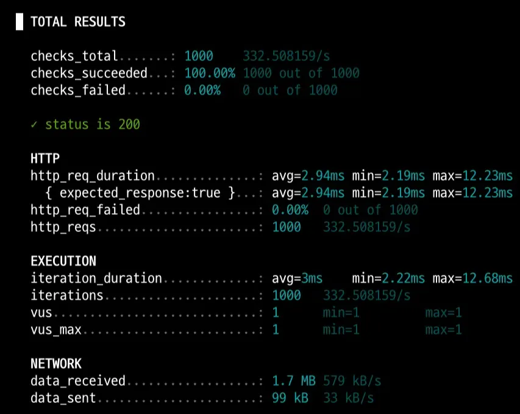 |

| **구분**   | **평균 응답 시간 (avg)** | **개선율**      |
|----------|--------------------|--------------|
| **개선 전** | 7.22 ms            | -            |
| **개선 후** | 2.94 ms            | **59.3% 단축** |

전체적으로 약 60% 수준의 성능 향상하는 결과를 보여주었다. 다음은 @EntityGraph 방식을 적용해 실험해보았다.

- **@EntityGraph 설정**

``` SQL
@EntityGraph(attributePaths = {"festival"})
List<FestivalNotification> findAllByDeviceId(Long deviceId);
```

<details>
  <summary>@EntityGraph 개선 쿼리 로그</summary>

``` SQL
Hibernate: 
    select
        d1_0.id,
        d1_0.created_at,
        d1_0.deleted,
        d1_0.deleted_at,
        d1_0.device_identifier,
        d1_0.fcm_token,
        d1_0.updated_at 
    from
        device d1_0 
    where
        d1_0.id=? 
        and (
            d1_0.deleted = 0
        )
Hibernate: 
    select
        fn1_0.id,
        fn1_0.created_at,
        fn1_0.deleted,
        fn1_0.deleted_at,
        fn1_0.device_id,
        fn1_0.festival_id,
        f1_0.id,
        f1_0.latitude,
        f1_0.longitude,
        f1_0.created_at,
        f1_0.deleted,
        f1_0.deleted_at,
        f1_0.end_date,
        f1_0.festival_name,
        f1_0.lost_item_guide,
        f1_0.start_date,
        f1_0.university_name,
        f1_0.updated_at,
        f1_0.user_visible,
        f1_0.zoom,
        fn1_0.updated_at 
    from
        festival_notification fn1_0 
    left join
        device d1_0 
            on d1_0.id=fn1_0.device_id 
            and (d1_0.deleted = 0) 
    join
        festival f1_0 
            on f1_0.id=fn1_0.festival_id 
            and (f1_0.deleted = 0) 
    where
        (
            fn1_0.deleted = 0
        ) 
        and d1_0.id=?
```
</details>

개선 과정에서 쿼리 로그를 확인한 결과, 여전히 불필요한 Left Join 쿼리가 발생하고 있었다. 이를 해결하기 위해 @EntityGraph와 직접 작성한 JPQL 쿼리를 함께 활용하여, 필요한 연관 엔티티만 효율적으로 조회하도록 수정했다.

<details>
  <summary>@EntityGraph + Left Join 개선 후 쿼리 로그</summary>

``` SQL
Hibernate: 
    select
        d1_0.id,
        d1_0.created_at,
        d1_0.deleted,
        d1_0.deleted_at,
        d1_0.device_identifier,
        d1_0.fcm_token,
        d1_0.updated_at 
    from
        device d1_0 
    where
        d1_0.id=? 
        and (
            d1_0.deleted = 0
        )
Hibernate: 
    select
        fn1_0.id,
        fn1_0.created_at,
        fn1_0.deleted,
        fn1_0.deleted_at,
        fn1_0.device_id,
        fn1_0.festival_id,
        f1_0.id,
        f1_0.latitude,
        f1_0.longitude,
        f1_0.created_at,
        f1_0.deleted,
        f1_0.deleted_at,
        f1_0.end_date,
        f1_0.festival_name,
        f1_0.lost_item_guide,
        f1_0.start_date,
        f1_0.university_name,
        f1_0.updated_at,
        f1_0.user_visible,
        f1_0.zoom,
        fn1_0.updated_at 
    from
        festival_notification fn1_0 
    join
        festival f1_0 
            on f1_0.id=fn1_0.festival_id 
            and (f1_0.deleted = 0) 
    where
        (
            fn1_0.deleted = 0
        ) 
        and fn1_0.device_id=?
```
</details>

이번 개선 과정에서 @EntityGraph를 활용해 Left Join 문제를 해결해보려 했지만, 해당 메서드는 비교적 단순한 조회임에도 불필요한 Left Join이 발생했다. 이를 제거하기 위해 결국 @Query를 직접 선언해야 했고, 그 과정에서 @EntityGraph의 장점인 “JPQL 수정 없이 Fetch 전략을 제어한다”는 이점이 사라졌다. 따라서, 동일한 목적을 더 명시적으로 표현할 수 있는 Fetch Join 방식을 적용하는 편이 낫다고 판단했다.

- **Fetch Join 설정**

``` SQL
    @Query("""
                SELECT FN
                FROM FestivalNotification FN
                JOIN FETCH FN.festival F
                WHERE FN.device.id = :deviceId
            """)
    List<FestivalNotification> findAllWithFestivalByDeviceId(Long deviceId);
```

<details>
  <summary>Fetch Join 개선 후 쿼리 로그</summary>

``` SQL
Hibernate: 
    select
        d1_0.id,
        d1_0.created_at,
        d1_0.deleted,
        d1_0.deleted_at,
        d1_0.device_identifier,
        d1_0.fcm_token,
        d1_0.updated_at 
    from
        device d1_0 
    where
        d1_0.id=? 
        and (
            d1_0.deleted = 0
        )
Hibernate: 
    select
        fn1_0.id,
        fn1_0.created_at,
        fn1_0.deleted,
        fn1_0.deleted_at,
        fn1_0.device_id,
        fn1_0.festival_id,
        f1_0.id,
        f1_0.latitude,
        f1_0.longitude,
        f1_0.created_at,
        f1_0.deleted,
        f1_0.deleted_at,
        f1_0.end_date,
        f1_0.festival_name,
        f1_0.lost_item_guide,
        f1_0.start_date,
        f1_0.university_name,
        f1_0.updated_at,
        f1_0.user_visible,
        f1_0.zoom,
        fn1_0.updated_at 
    from
        festival_notification fn1_0 
    join
        festival f1_0 
            on f1_0.id=fn1_0.festival_id 
            and (f1_0.deleted = 0) 
    where
        (
            fn1_0.deleted = 0
        ) 
        and fn1_0.device_id=?
```
</details>

|                 개선 전 (로컬 환경)                  |                  개선 후 (로컬 환경)                   |
|:---------------------------------------------:|:-----------------------------------------------:|
|  | 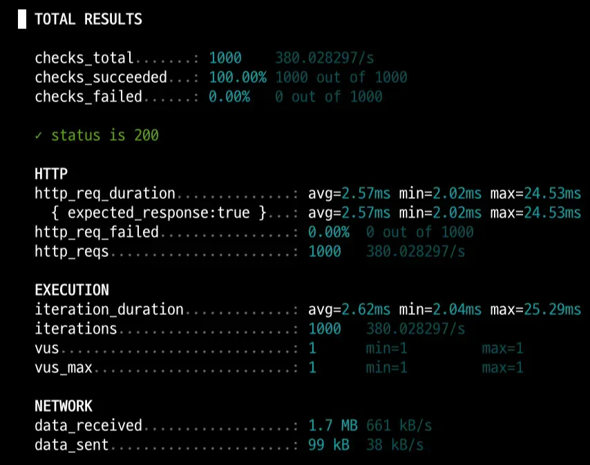 |

| **구분**   | **평균 응답 시간 (avg)** | **개선율**      |
|----------|--------------------|--------------|
| **개선 전** | 7.22 ms            | -            |
| **개선 후** | 2.57 ms            | **64.4% 단축** |

최종적으로, Batch 전략보다 Fetch Join과 @EntityGraph를 적용했을 때 더 높은 성능 개선 효과를 확인할 수 있었다.

다만 두 방식 중에서는, @EntityGraph의 핵심 장점인 JPQL 수정 없이 로딩 전략을 제어하는 편의성이 이번 케이스에서는 사라졌고, 쿼리의 명확성 측면에서도 Fetch Join 방식이 더 적합하다고 판단해 최종적으로 이를 선택했다. 아래는 개선된 쿼리를 Dev 적용한 후 실험 결과다.

|               개선 전 (Dev 환경)               |              개선 후 (Dev 환경)              |
|:-----------------------------------------:|:---------------------------------------:|
|  | 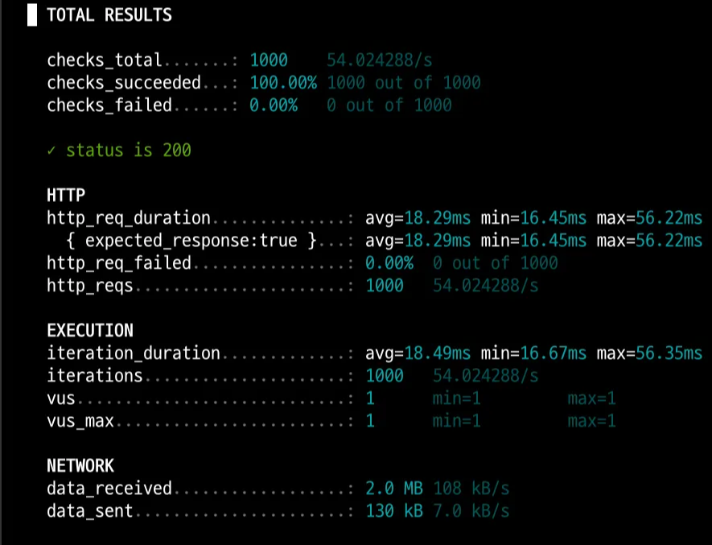 |

### POST festivals/{festivalId}/notifications

- 축제에 알림을 ON 기능

세 번째로는 알림 등록 API를 테스트했다. 이 역시 앞선 실험들과 동일한 방식으로 진행했다.

|                      로컬 환경                      |                   Dev 환경                    |
|:-----------------------------------------------:|:-------------------------------------------:|
| 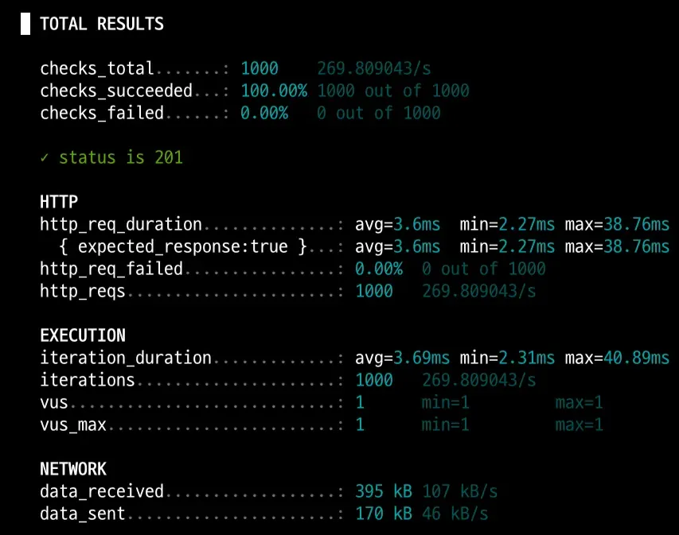 | 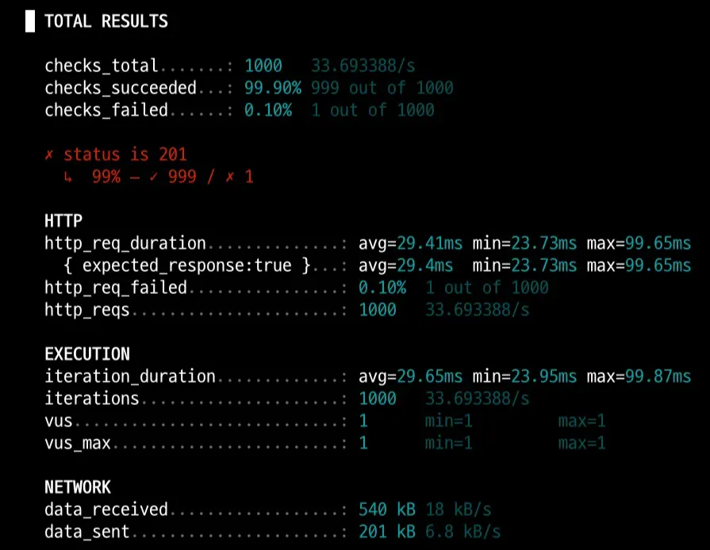 |

<details>
  <summary>쿼리 로그</summary>

``` SQL
Hibernate: 
    select
        fn1_0.id 
    from
        festival_notification fn1_0 
    left join
        festival f1_0 
            on f1_0.id=fn1_0.festival_id 
            and (f1_0.deleted = 0) 
    left join
        device d1_0 
            on d1_0.id=fn1_0.device_id 
            and (d1_0.deleted = 0) 
    where
        (
            fn1_0.deleted = 0
        ) 
        and f1_0.id=? 
        and d1_0.id=? 
    limit
        ?
Hibernate: 
    select
        f1_0.id,
        f1_0.latitude,
        f1_0.longitude,
        f1_0.created_at,
        f1_0.deleted,
        f1_0.deleted_at,
        f1_0.end_date,
        f1_0.festival_name,
        f1_0.lost_item_guide,
        f1_0.start_date,
        f1_0.university_name,
        f1_0.updated_at,
        f1_0.user_visible,
        f1_0.zoom 
    from
        festival f1_0 
    where
        f1_0.id=? 
        and (
            f1_0.deleted = 0
        )
Hibernate: 
    select
        d1_0.id,
        d1_0.created_at,
        d1_0.deleted,
        d1_0.deleted_at,
        d1_0.device_identifier,
        d1_0.fcm_token,
        d1_0.updated_at 
    from
        device d1_0 
    where
        d1_0.id=? 
        and (
            d1_0.deleted = 0
        )
Hibernate: 
    into
        festival_notification (created_at, deleted, deleted_at, device_id, festival_id, updated_at) 
    values
        (?, ?, ?, ?, ?, ?)
```
</details>

쿼리 로그의 첫 번째 구문을 보면, Left Join이 두 번 발생하는 것을 확인할 수 있다. 이에 쿼리 튜닝을 통해 이 부분을 개선하고, 실제 실행 계획을 분석하면서 쿼리 비용이 얼마나 줄어드는지 함께 확인했다.

``` SQL
Hibernate: 
    select
        fn1_0.id 
    from
        festival_notification fn1_0 
    left join
        festival f1_0 
            on f1_0.id=fn1_0.festival_id 
            and (f1_0.deleted = 0) 
    left join
        device d1_0 
            on d1_0.id=fn1_0.device_id 
            and (d1_0.deleted = 0) 
    where
        (
            fn1_0.deleted = 0
        ) 
        and f1_0.id=? 
        and d1_0.id=? 
    limit
        ?
```

Left Join이 두 번 발생하는 이유는 JPQL이 쿼리를 생성하는 과정에서 불필요한 조인을 포함하기 때문이었다. 해당 Join 제거 여부의 핵심은 deleted = 1인 데이터를 굳이 조회할 필요가 있는가 하는 점이다.

비즈니스 코드를 살펴본 결과, 이 쿼리의 목적은 “이미 알림을 구독한 축제인지 여부를 검증하는 것”이었다. 즉, 단순히 해당 festivalId가 존재하는지 확인하는 용도이므로, 실제로 필요한 것은 조인된 엔티티의 ID 값뿐이었다. 따라서 deleted = 1 검증이 필요한 상황이라면 JOIN이 불가피하지만, 단순 존재 여부 검증이라면 JOIN 없이도 충분히 조회가 가능했다.

이러한 판단을 바탕으로 개선 방향을 설정하고, Query , 출력 쿼리, 그리고 MySQL Workbench 실행 계획을 기준으로 비교·분석했다.

``` SQL
boolean existsByFestivalIdAndDeviceId(Long festivalId, Long deviceId);
```
이전 JPQL

``` SQL
-> Limit: 1 row(s)
    -> Filter: (device_id=82 AND festival_id=3800 AND deleted=0)
        -> Intersect rows sorted by row ID
            -> Index range scan (device_id=82)
            -> Index range scan (festival_id=3800)
```
이전 JPQL 실행 계획

``` SQL
select
        fn1_0.id 
    from
        festival_notification fn1_0 
    left join
        festival f1_0 
            on f1_0.id=fn1_0.festival_id 
            and (f1_0.deleted = 0) 
    left join
        device d1_0 
            on d1_0.id=fn1_0.device_id 
            and (d1_0.deleted = 0) 
    where
        (
            fn1_0.deleted = 0
        ) 
        and f1_0.id=? 
        and d1_0.id=? 
    limit
        ?
```
이전 JPQL 쿼리 결과

``` SQL
    @Query("""
                SELECT CASE WHEN COUNT(fn) > 0 THEN true ELSE false END
                FROM FestivalNotification fn
                WHERE fn.festival.id = :festivalId
                  AND fn.device.id = :deviceId
            """)
    boolean existsByFestivalIdAndDeviceId(
            @Param("festivalId") Long festivalId,
            @Param("deviceId") Long deviceId
    );
```
변경 JPQL

``` SQL
-> Aggregate: count(0)
    -> Filter: (device_id=82 AND festival_id=3800 AND deleted=0)
        -> Intersect rows sorted by row ID
            -> Index range scan (device_id=82)
            -> Index range scan (festival_id=3800)
```
변경 JPQL 실행 계획

``` SQL
Hibernate: 
    select
        case 
            when count(fn1_0.id)>0 
                then 1 
            else 0 
    end 
from
    festival_notification fn1_0 
where
    (
        fn1_0.deleted = 0
    ) 
    and fn1_0.festival_id=? 
    and fn1_0.device_id=?
```
변경 JPQL 쿼리 결과

``` SQL
    @Query(value = """
            SELECT EXISTS(
                SELECT 1
                FROM festival_notification fn
                WHERE fn.festival_id = :festivalId
                AND fn.device_id = :deviceId
                AND fn.deleted = 0
            )
            """, nativeQuery = true)
    Integer getExistsFlagByFestivalIdAndDeviceId(
            @Param("festivalId") Long festivalId,
            @Param("deviceId") Long deviceId
    );
```
변경 Native Query

``` SQL
Hibernate: 
    SELECT
        EXISTS(     SELECT
            1     
        FROM
            festival_notification fn     
        WHERE
            fn.festival_id = ?     
            AND fn.device_id = ?     
            AND fn.deleted = 0 ) 
```
변경 Native 쿼리 결과

``` SQL
-> Rows fetched before execution
-> Select
    -> Limit: 1 row(s)
        -> Filter: (deleted=0 AND device_id=82 AND festival_id=3800)
            -> Intersect rows sorted by row ID
                -> Index range scan (device_id=82)
                -> Index range scan (festival_id=3800)
```
변경 Native 실행 계획

두 가지 방법으로 개선해보면서 이전 상태와 두 개선된 결과를 한 번 표로 정리해봤다. 조기 종료는 Count 집계인 경우 전체 행을 찾아 계산하기 때문에 Exists 와 다른 종료 방식임을 의미한다.

또한, 실행 시간은 MySQL Workbench의 실행 계획으로 계산된 데이터이다.

| 항목            | ① 이전 JPQL                | ② 변경 JPQL                | ③ 변경 Native Query        |
|---------------|--------------------------|--------------------------|--------------------------|
| **주요 동작**     | LEFT JOIN + LIMIT        | COUNT(*) 집계              | EXISTS (LIMIT 1 내부 포함)   |
| **실행 방식**     | `index_merge(intersect)` | `index_merge(intersect)` | `index_merge(intersect)` |
| **조기 종료**     | ✅ 가능                     | ❌ 불가                     | ✅ 가능                     |
| **실행 시간(ms)** | 0.43~0.53                | 0.36~0.44                | 0.24~0.25                |
| **특징**        | JPA 기본, 불필요한 JOIN 포함     | 전수 집계, 단순하지만 비효율         | 가장 단순하고 효율적, int 반환      |

최종적으로 ‘③ 변경 Native Query’ 형태 적용해 실행 시간 약 48% 향상했다. 추후 복합 인덱스 적용해 더욱 우수한 성능 향상을 해볼 예정이다.

|                개선 전 (Dev 환경)                |               개선 후 (Dev 환경)               |
|:-------------------------------------------:|:-----------------------------------------:|
|  | 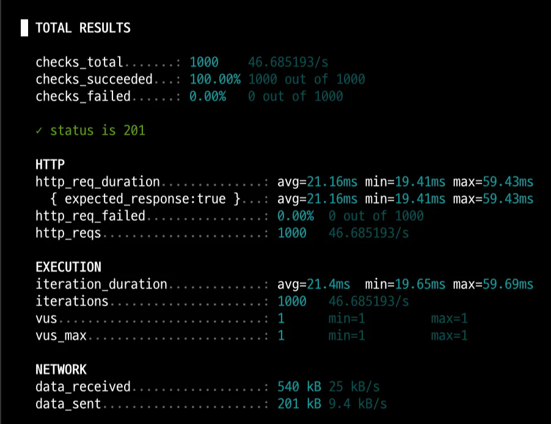 |

| **구분**   | **평균 응답 시간 (avg)** | **개선율**      |
|----------|--------------------|--------------|
| **개선 전** | 29.41 ms           | -            |
| **개선 후** | 21.16 ms           | **28.1% 단축** |

# **결론 ✍️**

두 가지 기능의 API를 개선하기 위해 데이터를 준비하고, 로컬 환경을 셋업하며, 외부 API 호출 시간을 최소화하기 위해 복제 API를 제작하는 등 성능 개선을 위한 일련의 과정을 체계적으로 수행했다. 그 과정에서 N+1 문제 해결과 불필요한 LEFT JOIN 쿼리 최적화를 통해 실제로 눈에 띄는 성능 향상을 경험할 수 있었다.

이번 경험을 통해 느낀 점은, JPA의 단점이 명확하게 드러났다는 것이다. N+1 문제나 불필요한 조인은, 만약 `JDBC`나 `MyBatis`를 사용했다면 발생하지 않았을 가능성이 높다. JPA는 분명히 개발 생산성을 높여주는 훌륭한 기술이지만, 동작 원리를 충분히 이해하지 못한 채 사용하면 오히려 성능 저하로 이어질 수 있다는 점을 직접 체감했다. 어찌 보면 이번 개선 과정은 단순한 성능 최적화가 아니라, JPA의 구조적 한계를 이해하고 개선해 나가는 과정이었다고 생각한다.

또한 과정 수행하면서 궁금한 점이 생겼다. 불필요한 Fetch Join이 발생하는 구체적인 이유와, Batch 전략이 오히려 느려진 이유를 더 깊이 분석해볼 계획이다.

다음 단계에서는 인덱스 최적화를 통해 쿼리 성능을 얼마나 더 향상시킬 수 있을지 실험해볼 예정이다. 이번 과정은 최적화의 기초 발판을 다진 의미 있는 단계였다.
